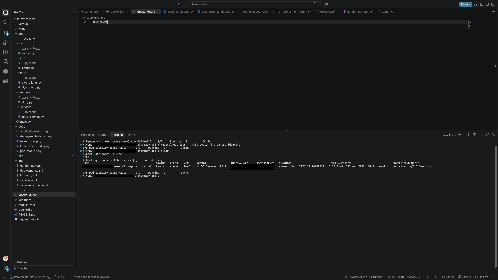
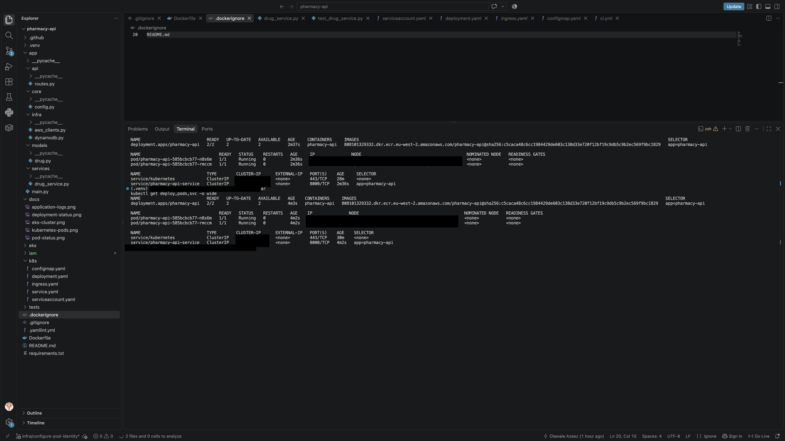
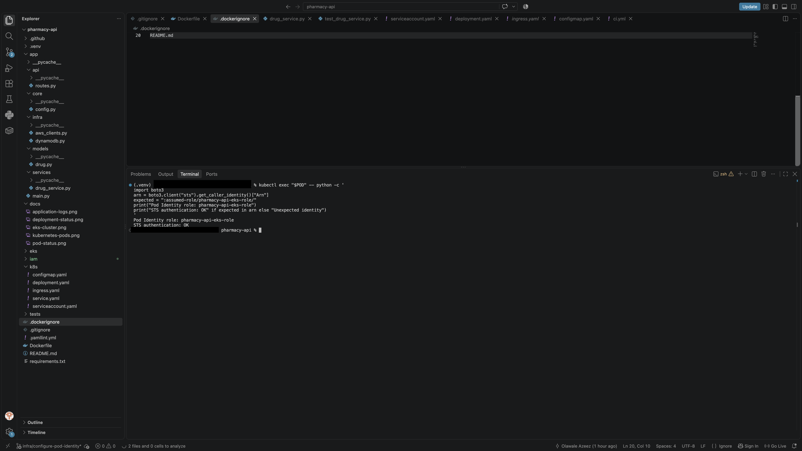
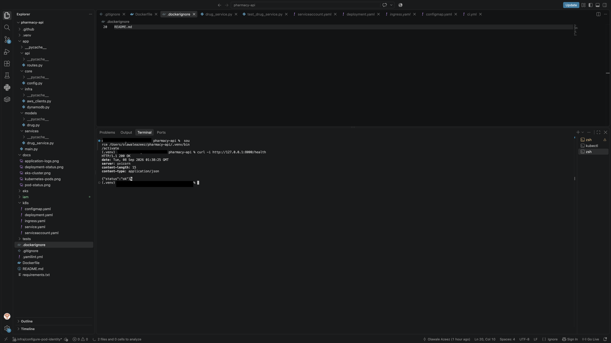
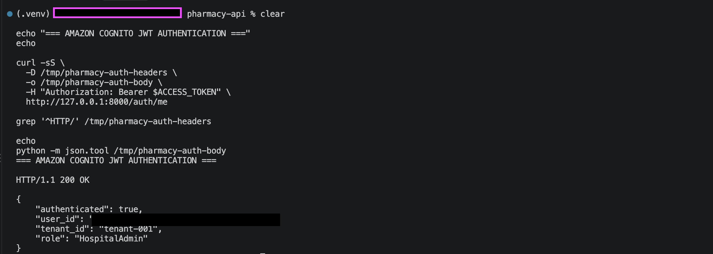
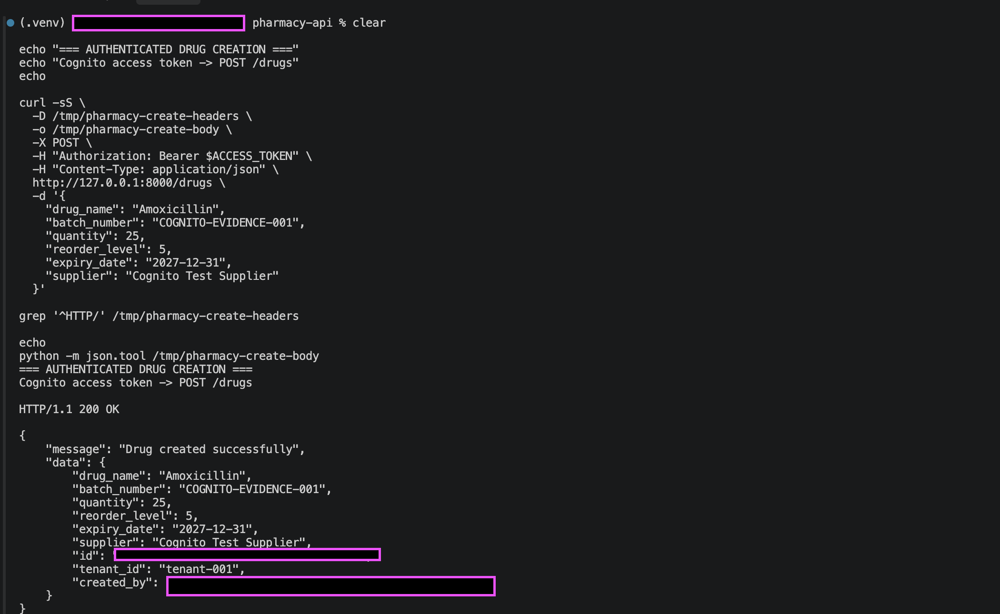
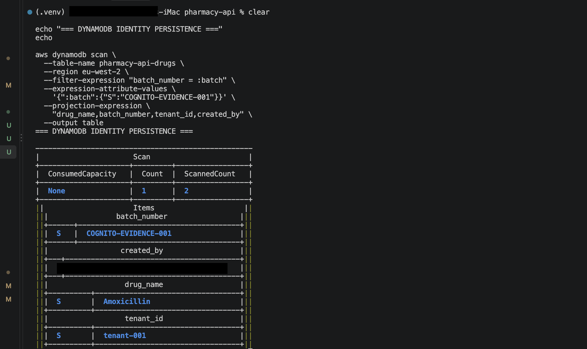
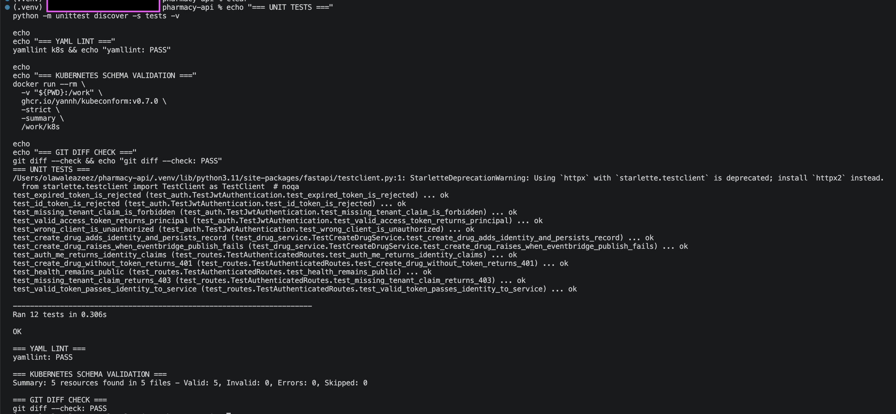

# Pharmacy API on Amazon EKS

[](https://github.com/AZ1600/pharmacy-api-eks/actions/workflows/ci.yml)
[](https://github.com/AZ1600/pharmacy-api-eks/actions/workflows/deploy.yml)


A cloud-native FastAPI workload engineered for Amazon EKS with hardened containers, Amazon Cognito authentication, EKS Pod Identity, DynamoDB persistence, EventBridge publishing, Kubernetes resilience controls, software supply-chain security checks, and GitHub Actions CI/CD using AWS OIDC.

**AWS Region:** `eu-west-2`

---

# Architecture

```text
End User
   │
   │ Amazon Cognito access token
   ▼
FastAPI
   │
   ├── RS256 signature validation
   ├── JWKS validation
   ├── issuer/client validation
   ├── expiration + token type checks
   └── tenant / role extraction
   │
   ▼
Protected API
   │
   ├── DynamoDB
   │     └── pharmacy-api-drugs
   │
   └── EventBridge
         └── DrugCreated


Amazon EKS
   │
   └── pharmacy-api Deployment
         │
         ├── FastAPI Pod
         ├── FastAPI Pod
         ├── PodDisruptionBudget
         ├── NetworkPolicy
         ├── startup/readiness/liveness probes
         └── EKS Pod Identity
               └── workload IAM role


GitHub Actions
   │
   ├── CI
   │     ├── Python tests
   │     ├── container validation
   │     ├── Kubernetes validation
   │     └── security validation
   │
   └── Manual deployment
         │
         ├── GitHub OIDC
         ├── AWS STS temporary credentials
         ├── ECR immutable image
         ├── SHA256 digest deployment
         └── EKS rollout + health verification
```

---

# What This Project Demonstrates

- Amazon EKS workload deployment
- Kubernetes 1.36
- hardened non-root containers
- immutable Amazon ECR image deployment
- startup, readiness, and liveness probes
- PodDisruptionBudget
- Kubernetes NetworkPolicy
- topology spread constraints
- rolling updates
- EKS Pod Identity
- least-privilege IAM
- Amazon Cognito authentication
- RS256 JWT verification
- Cognito JWKS validation
- issuer and client validation
- access-token enforcement
- tenant-aware identity extraction
- role extraction from Cognito groups
- DynamoDB persistence
- EventBridge publishing
- automated Python tests
- Kubernetes schema validation with kubeconform
- YAML linting
- dependency vulnerability scanning with `pip-audit`
- container vulnerability scanning with Trivy
- CycloneDX SBOM generation
- GitHub OIDC authentication to AWS
- short-lived AWS deployment credentials
- manual GitHub Actions deployment to Amazon EKS
- immutable Git SHA and SHA256 digest deployment
- EKS rollout and application health verification

---

# Deployment Evidence

## Amazon EKS Cluster

The managed worker node reached `Ready` state and the EKS Pod Identity Agent was validated during the original deployment phase.



## Running Kubernetes Workload

The FastAPI workload was validated with two replicas running on Amazon EKS using an immutable Amazon ECR image digest.



## EKS Pod Identity

The application Pod authenticated through the dedicated workload IAM role without storing long-lived AWS credentials inside the workload.



## Application Health

The deployed API returned `HTTP/1.1 200 OK` from `GET /health`.



---

# Amazon Cognito Authentication

The application uses real Amazon Cognito access tokens rather than hard-coded demo identity values.

```text
Client
  │
  │ Authorization: Bearer <access-token>
  ▼
FastAPI
  │
  ├── fetch Cognito JWKS
  ├── verify RS256 signature
  ├── verify issuer
  ├── verify client binding
  ├── verify expiration
  ├── verify token_use=access
  └── extract identity
        │
        ├── sub
        ├── cognito:groups
        ├── tenant
        └── role
```

OIDC configuration is supplied through environment variables:

```text
OIDC_ISSUER
OIDC_CLIENT_ID
OIDC_JWKS_URL
OIDC_TENANT_CLAIM
OIDC_ROLE_CLAIM
```

The implementation remains compatible with Amazon Cognito while keeping the application configuration portable.

---

# Cognito Identity Model

For the validated environment, Cognito group membership carries tenant and role information.

Example:

```text
tenant-tenant-001
role-HospitalAdmin
```

The API derives:

```text
tenant_id = tenant-001
role      = HospitalAdmin
user_id   = Cognito sub
```

The authenticated Cognito subject is persisted as `created_by` on new drug records.

---

# Cognito Authentication Evidence

A real Cognito access token was passed to:

```text
GET /auth/me
```

The API validated the token and returned the authenticated identity context.

```json
{
  "authenticated": true,
  "user_id": "<redacted-cognito-sub>",
  "tenant_id": "tenant-001",
  "role": "HospitalAdmin"
}
```



---

# Authenticated Drug Creation

`POST /drugs` requires a valid bearer token.

```text
Cognito access token
        ↓
POST /drugs
        ↓
JWT validation
        ↓
tenant + subject extraction
        ↓
DynamoDB persistence
        ↓
EventBridge event
```



The API does not accept caller-supplied identity fields. `tenant_id` and `created_by` are derived from the validated token.

---

# DynamoDB Identity Persistence

The authenticated request was verified directly in DynamoDB.

```text
drug_name    = Amoxicillin
batch_number = COGNITO-EVIDENCE-001
tenant_id    = tenant-001
created_by   = authenticated Cognito subject
```



---

# Authentication Behaviour

The API follows a fail-closed security model.

```text
Missing bearer token
        ↓
401 Unauthorized

Invalid signature / issuer / client / token type / expiration
        ↓
401 Unauthorized

Valid token without tenant identity
        ↓
403 Forbidden

Valid access token with required identity
        ↓
Request allowed
```

The public `GET /health` endpoint intentionally remains unauthenticated so Kubernetes probes and operational health checks can function without user credentials.

---

# Example Authenticated Request

```bash
curl -X POST http://127.0.0.1:8000/drugs \
  -H "Authorization: Bearer $ACCESS_TOKEN" \
  -H "Content-Type: application/json" \
  -d '{
    "drug_name": "Amoxicillin",
    "batch_number": "COGNITO-EVIDENCE-001",
    "quantity": 25,
    "reorder_level": 5,
    "expiry_date": "2027-12-31",
    "supplier": "Cognito Test Supplier"
  }'
```

---

# Security Engineering

## Container Security

The runtime container:

- runs as non-root `appuser`
- uses a minimal Python slim base image
- excludes development files with `.dockerignore`
- excludes local virtual environments
- drops all Linux capabilities
- uses `no-new-privileges`
- supports a read-only root filesystem
- limits writable storage to `/tmp`
- removes unnecessary packaging tooling from the runtime image
- upgrades vulnerable base OS packages during image build

## Kubernetes Security and Resilience

The workload includes:

- `runAsNonRoot: true`
- fixed non-root UID and GID
- `allowPrivilegeEscalation: false`
- `readOnlyRootFilesystem: true`
- all Linux capabilities dropped
- `RuntimeDefault` seccomp profile
- CPU and memory requests/limits
- startup probe
- readiness probe
- liveness probe
- memory-backed `/tmp`
- rolling updates with `maxUnavailable: 0`
- dedicated ServiceAccount
- disabled automatic ServiceAccount token mounting
- PodDisruptionBudget with minimum availability
- ingress NetworkPolicy
- topology spread constraints

---

# AWS Workload Identity

The application uses **Amazon EKS Pod Identity** for AWS service access.

This is separate from Cognito end-user authentication.

```text
End User Identity
        ↓
Amazon Cognito
        ↓
JWT
        ↓
FastAPI


Workload Identity
        ↓
EKS Pod Identity
        ↓
IAM Role
        ↓
DynamoDB / EventBridge
```

This creates two distinct security boundaries:

```text
Who is the user?
→ Cognito

What AWS services may the workload access?
→ IAM + EKS Pod Identity
```

No AWS access key or secret key is stored inside the Kubernetes workload.

---

# IAM Permissions

The workload IAM role is restricted to the application operations it needs.

## DynamoDB

```text
dynamodb:GetItem
dynamodb:PutItem
```

Scoped to:

```text
pharmacy-api-drugs
```

## EventBridge

```text
events:PutEvents
```

Scoped to the configured event bus.

The repository also includes a separate GitHub Actions deployment policy and OIDC trust policy. The deployment identity is restricted to the Pharmacy API repository, `main` branch, the Pharmacy ECR repository, and the target EKS cluster.

---

# DynamoDB

Drug records are stored in:

```text
pharmacy-api-drugs
```

Configuration:

```text
Partition Key: id
Type: String
Billing Mode: PAY_PER_REQUEST
```

Stored records include authenticated identity context:

```text
id
drug_name
batch_number
quantity
reorder_level
expiry_date
supplier
tenant_id
created_by
```

---

# EventBridge

Successful drug creation publishes:

```text
Source:     pharmacy-api
DetailType: DrugCreated
```

The event bus is configured with `EVENT_BUS_NAME`.

The application checks `FailedEntryCount` and raises an error if EventBridge reports a failed entry.

---

# Automated Validation

Current application test coverage includes:

- valid access token
- expired access token
- ID token rejection
- wrong client rejection
- missing tenant rejection
- authenticated principal creation
- public health endpoint
- missing bearer token
- `/auth/me`
- identity propagation into the service layer
- DynamoDB record creation
- EventBridge success handling
- EventBridge failure handling

Current result:

```text
12 tests
OK
```

---

# Continuous Integration

GitHub Actions runs on:

```text
pull_request
push to main
```

The CI workflow validates four areas.

## Python Tests

```text
Install dependencies
        ↓
Compile application modules
        ↓
Run unit tests
```

## Container Validation

```text
Build Docker image
        ↓
Verify non-root image user
        ↓
Run hardened container
        │
        ├── read-only filesystem
        ├── drop all capabilities
        ├── no-new-privileges
        └── memory-backed /tmp
        ↓
Verify /health
        ↓
Confirm runtime UID is non-root
```

## Kubernetes Validation

```text
Kubernetes YAML
      │
      ├── yamllint
      └── kubeconform
```

## Security Validation

```text
Python dependencies
      ↓
pip-audit
      ↓
Known vulnerability gate

Docker image
      ↓
Trivy
      ↓
HIGH / CRITICAL vulnerability gate
      ↓
CycloneDX SBOM
      ↓
GitHub Actions artifact
```

The security pipeline was used to identify and remediate real dependency and runtime image findings before the changes were merged.

---

# CI / Validation Evidence

Validation includes:

```text
Python tests:                PASS
YAML lint:                   PASS
Kubernetes resources:       7 valid
Kubernetes invalid:         0
Kubernetes schema errors:   0
pip-audit:                   PASS
Trivy HIGH/CRITICAL gate:   PASS
CycloneDX SBOM:             generated
git diff --check:            PASS
```

Existing CI evidence:



---

# Continuous Deployment

The repository includes a **manual** GitHub Actions deployment workflow for Amazon EKS.

```text
GitHub Actions
      │
      ├── workflow_dispatch
      ├── explicit deployment confirmation
      └── main branch only
      │
      ▼
GitHub OIDC
      │
      ▼
AWS STS
short-lived credentials
      │
      ▼
Amazon ECR
      │
      ├── build image
      ├── tag with Git commit SHA
      └── resolve SHA256 digest
      │
      ▼
Amazon EKS
      │
      ├── render runtime configuration
      ├── deploy immutable image digest
      ├── wait for rollout
      └── verify /health
```

No long-lived AWS credentials are required by the workflow.

Deployment is intentionally manual so normal pushes and pull requests do not create AWS runtime usage or infrastructure cost.

The workflow expects repository variables such as:

```text
AWS_DEPLOY_ROLE_ARN
OIDC_ISSUER
OIDC_CLIENT_ID
```

---

# EKS Infrastructure

The repository includes:

```text
eks/cluster.yaml
```

The cluster definition contains:

- cluster name: `pharmacy-eks`
- region: `eu-west-2`
- Kubernetes 1.36
- managed EC2 node group
- `t3.medium` worker
- desired capacity: 1
- minimum capacity: 1
- maximum capacity: 2
- EKS Pod Identity Agent
- project/environment tags

The EKS environment can be removed when it is not actively being demonstrated to avoid unnecessary AWS cost.

---

# Kubernetes Deployment

The committed deployment manifest uses a portable image placeholder:

```text
REPLACE_IMAGE_URI
```

The GitHub Actions deployment workflow replaces it with an immutable ECR image digest at deploy time.

For manual local deployment, provide the desired image URI before applying the manifest.

Apply resources:

```bash
kubectl apply -f k8s/
```

Wait for rollout:

```bash
kubectl rollout status deployment/pharmacy-api
```

Inspect:

```bash
kubectl get deploy,pods,svc -o wide
```

OIDC/Cognito configuration is supplied through the ConfigMap.

Example:

```yaml
OIDC_ISSUER: "https://cognito-idp.eu-west-2.amazonaws.com/REPLACE_USER_POOL_ID"
OIDC_CLIENT_ID: "REPLACE_APP_CLIENT_ID"
OIDC_TENANT_CLAIM: "custom:tenant_id"
OIDC_ROLE_CLAIM: "custom:role"
```

---

# Local Development

Example environment:

```bash
export OIDC_ISSUER="https://cognito-idp.eu-west-2.amazonaws.com/<user-pool-id>"
export OIDC_CLIENT_ID="<app-client-id>"

export AWS_DEFAULT_REGION="eu-west-2"
export TABLE_NAME="pharmacy-api-drugs"
export EVENT_BUS_NAME="default"
```

Start the API:

```bash
uvicorn app.main:app --reload
```

Health check:

```bash
curl -i http://127.0.0.1:8000/health
```

Expected:

```text
HTTP/1.1 200 OK
```

---

# Docker

Build:

```bash
docker build -t pharmacy-api .
```

Run:

```bash
docker run \
  --rm \
  --name pharmacy-api \
  --publish 8000:8000 \
  pharmacy-api
```

Hardened runtime:

```bash
docker run \
  --rm \
  --publish 8000:8000 \
  --read-only \
  --cap-drop ALL \
  --security-opt no-new-privileges:true \
  --tmpfs /tmp:rw,noexec,nosuid,size=16m \
  pharmacy-api
```

---

# Amazon ECR

The deployment path uses immutable images rather than `latest`.

```text
Git commit SHA tag
        ↓
Amazon ECR
        ↓
Resolve SHA256 digest
        ↓
image@sha256:...
        ↓
Amazon EKS
```

This provides deterministic deployment and stronger traceability between source revision and runtime image.

---

# Repository Structure

```text
.
├── .github/
│   └── workflows/
│       ├── ci.yml
│       └── deploy.yml
│
├── app/
│   ├── api/
│   │   └── routes.py
│   ├── core/
│   │   ├── config.py
│   │   └── security.py
│   ├── infra/
│   │   ├── aws_clients.py
│   │   └── dynamodb.py
│   ├── models/
│   │   └── drug.py
│   ├── services/
│   │   └── drug_service.py
│   └── main.py
│
├── docs/
│   ├── cognito-authentication.png
│   ├── cognito-ci-validation.png
│   ├── cognito-drug-create.png
│   ├── cognito-dynamodb-persistence.png
│   ├── dynamodb-persistence.png
│   ├── eks-cluster-ready.png
│   ├── github-actions-ci.png
│   ├── health-check.png
│   ├── pharmacy-workload-running.png
│   └── pod-identity-proof.png
│
├── eks/
│   └── cluster.yaml
│
├── iam/
│   ├── github-actions-deploy-policy.json
│   ├── github-actions-trust.json
│   ├── pharmacy-api-policy.json
│   └── pod-identity-trust.json
│
├── k8s/
│   ├── configmap.yaml
│   ├── deployment.yaml
│   ├── ingress.yaml
│   ├── network-policy.yaml
│   ├── pod-disruption-budget.yaml
│   ├── service.yaml
│   └── serviceaccount.yaml
│
├── tests/
│   ├── test_auth.py
│   ├── test_drug_service.py
│   └── test_routes.py
│
├── .dockerignore
├── .gitignore
├── .yamllint.yml
├── Dockerfile
├── requirements.txt
└── README.md
```

---

# Engineering Skills Demonstrated

## AWS

- Amazon EKS
- Amazon ECR
- Amazon Cognito
- DynamoDB
- EventBridge
- AWS IAM
- AWS STS
- GitHub OIDC federation
- EKS Pod Identity
- EC2 managed worker nodes

## Identity and Security

- OIDC
- JWT
- RS256 signatures
- JWKS
- issuer validation
- client validation
- access-token enforcement
- tenant-aware identity
- role-aware identity
- least-privilege IAM
- short-lived deployment credentials
- fail-closed authentication

## Kubernetes

- Deployments
- Services
- ServiceAccounts
- startup probes
- readiness probes
- liveness probes
- rolling updates
- PodDisruptionBudget
- NetworkPolicy
- topology spread constraints
- security contexts
- resource requests and limits
- seccomp
- Linux capability reduction
- Kubernetes manifest validation

## Container and Supply-Chain Security

- Docker
- non-root containers
- immutable images
- read-only root filesystems
- Linux capability reduction
- restricted writable filesystem paths
- `pip-audit`
- Trivy
- CycloneDX SBOM
- vulnerability remediation

## DevOps / CI-CD

- GitHub Actions
- pull request workflows
- automated Python tests
- container runtime validation
- YAML linting
- kubeconform schema validation
- GitHub OIDC
- ECR image publishing
- immutable digest deployment
- EKS rollout verification
- application health verification

## Backend Engineering

- Python
- FastAPI
- PyJWT
- boto3
- REST APIs
- DynamoDB
- EventBridge
- authenticated tenant context
- dependency-based FastAPI authentication

---

# Current Limitations

Current production concerns include:

- tenant separation is encoded through Cognito groups rather than a dedicated identity-management model
- role values are application-defined strings
- DynamoDB tenant isolation is application-level rather than enforced through the table key design
- the EventBridge bus currently uses the AWS default event bus
- the ingress manifest requires a compatible ingress controller
- full external production ingress is not configured
- Cognito infrastructure is not yet provisioned through Infrastructure as Code
- full application observability has not yet been implemented
- token revocation/session-management workflows are not implemented in the API
- authorization validates identity context but does not yet provide fine-grained per-role endpoint permissions
- the EKS cluster definition itself is still managed separately from the application deployment workflow

---

# Next Improvements

Potential future iterations include:

- fine-grained role-based endpoint authorization
- Cognito infrastructure through Terraform or CloudFormation
- DynamoDB tenant-aware partition keys
- dedicated EventBridge event bus
- EventBridge retry and DLQ handling
- Horizontal Pod Autoscaling
- AWS Load Balancer Controller
- Prometheus metrics
- Grafana dashboards
- CloudWatch alarms
- OpenTelemetry tracing
- end-to-end integration tests
- automated AWS infrastructure provisioning
- container image signing
- artifact provenance / attestations
- token/session revocation strategy

---

# Completed Roadmap

```text
[Complete] FastAPI application
[Complete] Hardened Docker image
[Complete] Kubernetes deployment
[Complete] Amazon ECR
[Complete] Immutable image digest
[Complete] Amazon EKS deployment
[Complete] EKS Pod Identity
[Complete] Least-privilege IAM
[Complete] DynamoDB persistence
[Complete] EventBridge publishing
[Complete] GitHub Actions CI
[Complete] Kubernetes validation

[Complete] Amazon Cognito User Pool validation
[Complete] Cognito App Client
[Complete] Real Cognito access token
[Complete] JWKS signature validation
[Complete] JWT issuer validation
[Complete] JWT client validation
[Complete] JWT expiration validation
[Complete] Access-token validation
[Complete] Tenant extraction
[Complete] Role extraction
[Complete] Authenticated /auth/me endpoint
[Complete] Protected POST /drugs
[Complete] Authenticated DynamoDB identity persistence
[Complete] EventBridge failure validation

[Complete] Startup probe
[Complete] PodDisruptionBudget
[Complete] Kubernetes NetworkPolicy
[Complete] Topology spread constraints
[Complete] Python dependency vulnerability scanning
[Complete] Container vulnerability scanning
[Complete] Vulnerability remediation
[Complete] CycloneDX SBOM generation
[Complete] GitHub OIDC AWS authentication design
[Complete] Least-privilege deployment IAM policy
[Complete] Manual Amazon EKS deployment workflow
[Complete] Immutable Git SHA container delivery
[Complete] SHA256 digest rendering
[Complete] EKS rollout verification
[Complete] Application health verification
```

---

# Purpose

This repository is an **AWS cloud-native workload engineering and application security case study**.

It demonstrates how a Python API can be:

- containerized securely
- hardened as a non-root workload
- published to Amazon ECR
- deployed using immutable image digests
- operated on Amazon EKS
- granted AWS access using EKS Pod Identity
- authenticated using Amazon Cognito
- protected using real JWT validation
- made tenant-aware through validated identity
- integrated with DynamoDB
- integrated with EventBridge
- validated through automated tests
- protected by dependency and container vulnerability gates
- documented with an SBOM
- prepared for GitHub OIDC-based deployment without long-lived AWS credentials

The project focuses on practical Cloud Engineering, Platform Engineering, Kubernetes, AWS workload security, application identity, software supply-chain security, and cloud-native application delivery.

---

# Author

**Olawale Azeez**

Cloud Engineer | Platform Engineer | AWS Certified Developer – Associate

AWS • Kubernetes • Platform Engineering • Cloud Infrastructure • DevOps • Cloud-Native Application Delivery